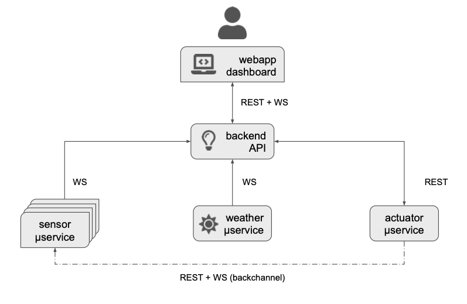
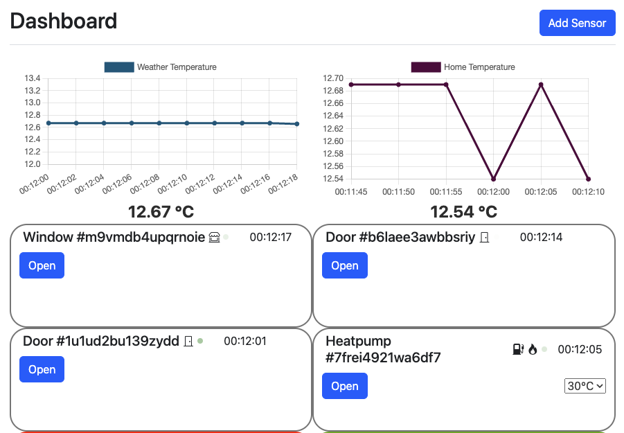
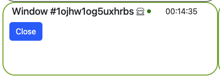
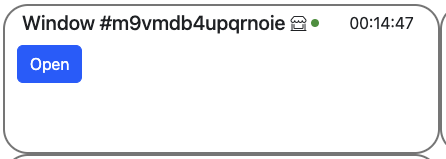
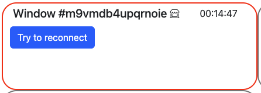
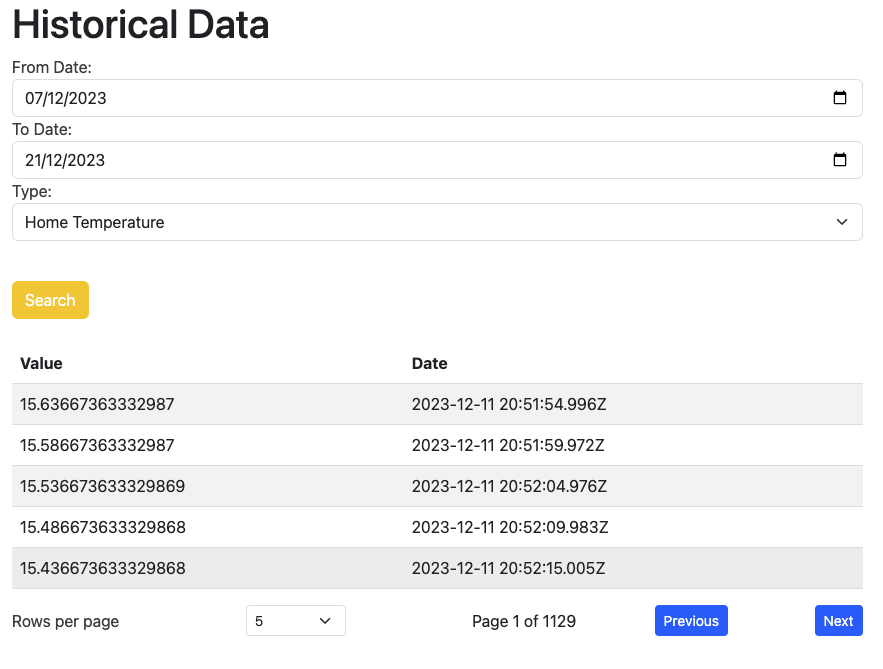
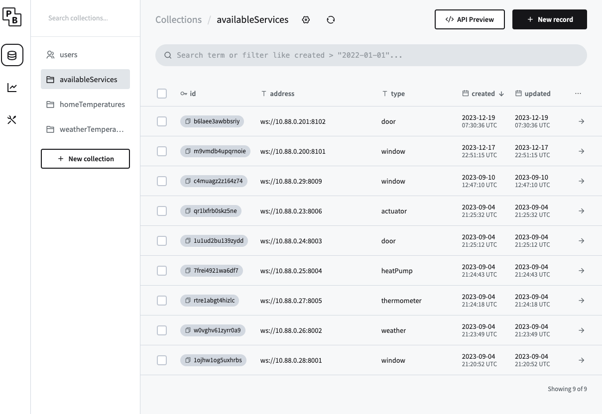

Project SOI Montorsi

To start the project, execute the following command in the terminal:
``` 
docker-compose up --build
``` 
Access the application via:

**Address**: http://montorsi.soi2223.unipr.it:8080/

**Username**: marcomonto

**Password**: password

Make sure to add the following address to the /etc/hosts file:
``` 
127.0.0.1       localhost montorsi.soi2223.unipr.it
``` 
Database Address:

**Address**: http://localhost:8085/_/

**Username**: prova@mail.com

**Password**: provaprova


## Architecture




## Autenticazione
Authentication occurs through simple credentials, username,
and password. Upon correct credentials, one gets logged in.
The authentication relies on a JWT token saved as an HTTP-only cookie
to prevent possible code manipulation from JavaScript.


Upon accessing the web app with an active session, the user will be redirected to the home.

## Dashboard
The user will see real-time data from various sensors through a secure WebSocket connection.



The component rendering occurs using the rxjs library, responsible for rendering the graphical elements based on inputs from the server.
Additionally, Bootstrap 5 is used to ease the development of various graphical components.

The panel offers the possibility to open and close various sensors to influence the internal temperature.

When a sensor is open, the border will be green with the close button active.



When a sensor is closed, the border will be grey with the open button active.



In the case of a sensor error, the border will be red with the reconnect test button active.



Temperature calculation is simulated for obvious reasons; the algorithm can be reviewed in the thermometer-service/src/temperature.js file.
In short, it varies based on the delta between external and internal temperatures, with linear dependencies on windows and doors,
where the door's weight is simply double that of the window. The heat pump will influence the internal temperature based on its operating temperature.
In the case of a sensor error, the algorithm treats it as closed.

### Dynamic Sensor Addition

There's also the possibility to dynamically add door and/or window services. Before adding them to the dialogue, 
you need to launch the docker containers of the services you want to add, as shown in the example:
``` 
docker run -p 8101:8101 --name new-window --network app-network --ip 10.88.0.200 -e IFACE=10.88.0.200 -e PORT=8101 -e=ERROR_PROB=0 window
``` 
Once the container is launched, you'll have to add the sensor using the syntax ws://[ipAddress]:[port]


### Handling Sensor Failures
In case of sensor errors, you can attempt to reactivate the connection via WebSocket, or cyclically,
the frontend calls an API responsible for attempting to reactivate the sensors in error.

## Historical View

There's the possibility to view saved data from the database in a tabular form.





## Database con Pocketbase
To save data in the database, Pocketbase, a Backend as a Service (BAAS) based on Go and sqlite, is used.
It allows immediate implementation of CRUD APIs automatically and offers other interesting possible implementations.



