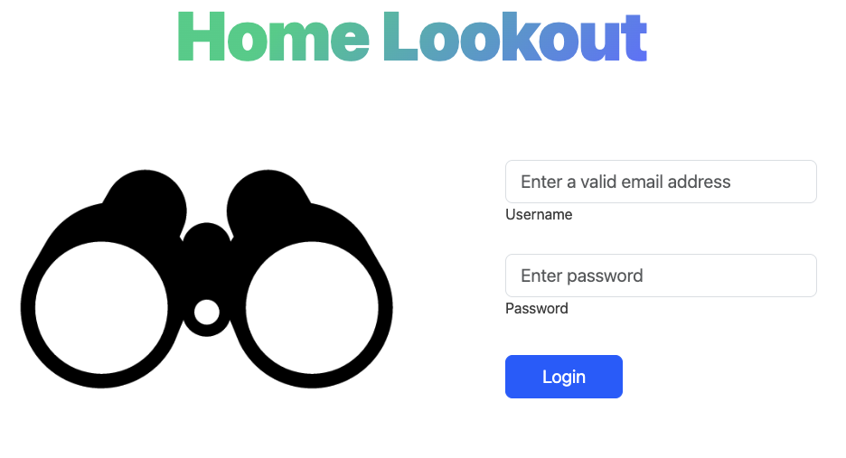
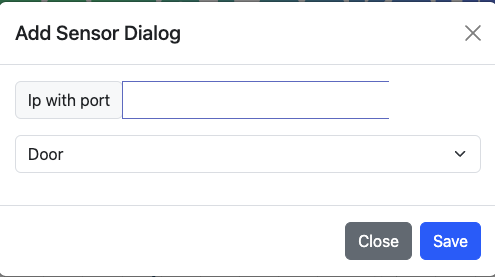

//TODO TO FINISH

Progetto SOI Montorsi
Per avviare il progetto, esegui il seguente comando nel terminale:

docker-compose up --build

Accedi all'applicazione tramite:

Indirizzo: http://montorsi.soi2223.unipr.it:8080/
**Username**: marcomonto
**Password**: password


Indirizzo del Database:

Indirizzo: http://localhost:8085/_/
**Username**: prova@mail.com
**Password**: provaprova
## Architettura


## Autenticazione
L'autenticazione avviene tramite delle semplici credenziali, user e password,
in caso di credenziali corrette, si viene loggati, l'autenticazione è basata su un JWT token
salvato come cookie in http only, per evitare una possibile code manipulation da javascript.



Ovviamente se si accede alla web app con una sessione già attiva si verrà reindirizzati alla home

## Dashboard
L'utente vedrà in tempo reale, grazie a una connessione webSocket protetta, i dati dei vari sensori.


Il render dei componenti avviene tramite l'utilizzo della libreria **rxjs** che si occupa di renderizzare correttamente
i vari elementi grafici in base agli input dal server, inoltre per facilitare lo sviluppo si è utilizzato Boostrap 5 per diversi
componenti grafici.

Il pannello offre la possibilità di aprire e chiudere i vari sensori, cosi da influenzare la temperatura interna.

In caso di sensore aperto il bordo sarà di colore verde con attivo il bottone di chiusura.


In caso di sensore chiuso il bordo sarà di colore grigio con attivo il bottone di apertura.


In caso di sensore in errore il bordo sarà di colore rosso con attivo il bottone di prova di riconessione.


Il calcolo della temperatura viene, per ovvi motivi, simulato;
Per vedere come funziona l'algoritmo si può visionare il file in **thermometer-service/src/temperature.js**.
In maniera concisa, varia in base al delta tra temperatura esterna e interna. 
Con dipendenze lineari da finestre e porte dove semplicemente la porta avrà il doppio del peso della finestra.
La pompa di calore influenzerà la temperatura interna in base ovviamente alla temperatura di operazione.
In caso di sensore in errore l'algoritmo lo ritiene come se fosse chiuso.

### Aggiunta dinamica sensori

E' presente anche la possibilità di aggiungere dinamicamente servizi di tipo **porta** e/o **finestra**.
Prima di inserirli nel dialogo, bisogna lanciare i container docker dei servizi che si vogliono aggiungere, come da esempio
``` 
docker run -p 8101:8101 --name new-window --network app-network --ip 10.88.0.200 -e IFACE=10.88.0.200 -e PORT=8101 -e=ERROR_PROB=0 window
``` 
Una volta lanciato il container si dovrà aggiungere il sensore con la sintassi
**ws://[ipAddress]:[port]**



### Gestione caduta sensori
In caso di errore dei sensori, si può cercare di riattivare nuovamente la connessione tramite webSocket, oppure ciclicamente lato 
frontend viene richiamata una api che ha il compito di andare a cercare di riattivare i sensori in errore.

## Visione storico 

Esiste la possibilità di visionare in forma tabellare i vari dati salvati a database.


## Database con Pocketbase
Per salvare dati in database si usa il BAAS (Backend as a service) **Pocketbase**, un ottima soluzione basata su Go e sqlite,
la quale permette una immediata implementazione di api crud in maniera automatica, ed altre interessanti possibili implementazioni.


